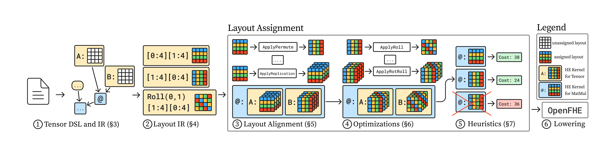

Rotom Documentation
==========================

Welcome to Rotom!

Rotom is an HE compiler framework for lowering high-level tensor operations into optimized homomorphic encryption programs. Rotom's goal is to try and solve the layout assignment problem: assign layouts to each tensor operation such that the cost of the program is minimized. Rotom supports various high-level tensor operations and HE specific optimization techniques, including baby-step giant-step algorithm. 

Architecture Overview
====================

Rotom's compilation process:

1. **Tensor Frontend**: High-level tensor operations and expressions
2. **Layout IR**: Intermediate representation with layout and dimension analysis
3. **Layout Assignment**: Optimizing layout choices and kernel generation 
4. **Lowering**: Lower to HE operations

Installation
============

1. **Clone the repository**:

   .. code-block:: bash

      git clone https://github.com/cmu-cryptosystems/Rotom.git
      cd Rotom

2. **Create a virtual environment** (recommended):

   .. code-block:: bash

      python -m venv .venv
      source .venv/bin/activate  

3. **Install dependencies**:

   .. code-block:: bash

      pip install -r requirements.txt

Dependencies
------------

Rotom depends on the following Python packages:

* **NumPy**: For numerical computations and tensor operations
* **OpenFHE**: For CKKS homomorphic encryption
* **Sphinx**: For documentation generation (optional)

All dependencies are listed in the `requirements.txt` file.

Testing
========

1. **Run all unit tests**:

   .. code-block:: bash

      pytest

2. **Run a specific test file**:

   .. code-block:: bash

      pytest -k test_matmul_ct_pt_1

Quick Start
===========

Get started with Rotom by running ``main.py``:

Basic Usage
-----------

Start with the default matrix multiplication benchmark:

.. code-block:: bash

   # Runs default matrix-vector multiplication benchmark with toy backend
   python main.py

Backends
--------

Choose your homomorphic encryption backend:

.. code-block:: bash

   python main.py --backend toy     # Toy backend (testing/development)
   python main.py --backend ckks    # CKKS backend (OpenFHE)

Benchmarks
----------

Run pre-built benchmarks to see Rotom in action:

.. code-block:: bash

   python main.py --benchmark distance          # Distance computation
   python main.py --benchmark matmul            # Matrix multiplication
   python main.py --benchmark convolution       # Convolution operations
   python main.py --benchmark bert_attention    # BERT attention mechanism

Microbenchmarks
---------------

Test specific operations and optimizations:

.. code-block:: bash

   python main.py --microbenchmark conversion      # Conversion operations
   python main.py --microbenchmark roll            # Roll operations
   python main.py --microbenchmark slot_conversion # Slot conversion
   python main.py --microbenchmark slot_roll       # Slot roll operations

Configuration Options
---------------------

Rotom's flags:

.. code-block:: bash

   python main.py --n 8192                       # Set number of slots 
   python main.py --rolls                        # Enable roll optimizations
   python main.py --net lan                      # Set network type (lan/wan)
   python main.py --cache                        # Enable input caching
   python main.py --serialize                    # Enable input serialization
   python main.py --mock                         # Enable mock inputs for testing
   python main.py --fuzz                         # Enable fuzzing
   python main.py --fuzz_result                  # Enable result fuzzing

.. toctree::
   :maxdepth: 2
   :caption: Documentation:

   writing_tensor_programs
   understanding_layout_representations
   user_guide/index
   api_reference/index
   